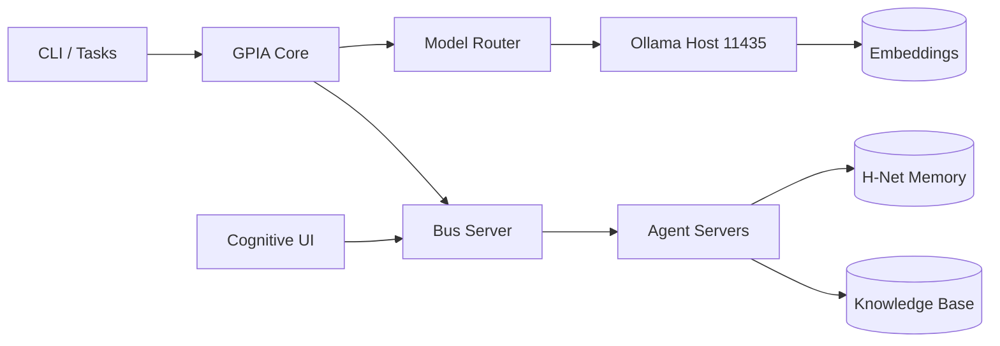
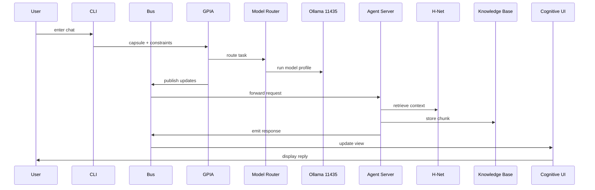

# Architecture

CLI AI (GPIA) is a local-first cognitive ecosystem composed of modular subsystems bound by a message bus. H-Net dynamic chunking keeps agents responsive while preserving long-term context, and the model router coordinates specialized local LLM profiles.

## Component Diagram

## Chat Sequence

## Sovereignty Wrapper Contract

The heartbeat runs through a mandatory middleware gate before any planning:

1) **Identity Filter**: `core/sovereignty_v2/identity_checker.py` validates `queue.json` against core values in `memory/agent_state_v1/ledger.json`. Refusals are logged to `refusal_log.jsonl` and the heartbeat halts for that cycle.
2) **Telemetry Constraint**: `core/sovereignty_v2/telemetry_observer.py` samples CPU/RAM/VRAM/Network and enforces budget thresholds. If VRAM >= 85%, the wrapper returns a lighter-model hint.
3) **Handoff**: The sanitized context is injected into the heartbeat observations so the planner can act with explicit constraints.

Wrapper entrypoint: `core/sovereignty_v2/sovereignty_wrapper.py`

Heartbeat audit: each cycle stores a structured `sovereignty_trace` in episodic memory for refusal/shed visibility and regression baselines.

## Resonance Gate (Temporal Formalism)

`run.py` evaluates each heartbeat against the Temporal Formalism contract (`core/resonant_kernel/interface.py`). If the resonance score drops below the configured threshold, the cycle is blocked and a structured `resonance_trace` is written to episodic memory.

## Control Plane Budgets

`system/control-plane` enforces stage and per-skill resource budgets, applying baseline floors from `memory/agent_state_v1/heuristics.json` to prevent limits from drifting too low.

## Rollback Gate

`core/sovereignty_v2/rollback_gate.py` runs regression checks before updates when `GPIA_ROLLBACK_GATE=1`. Failing checks can block writes and trigger a rollback request.
